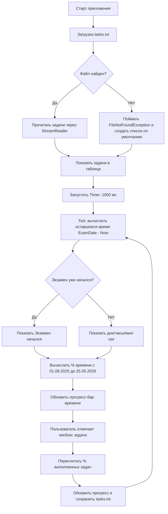

# Блок-схема алгоритма StudyTrack

```mermaid
flowchart TD
    A[Старт приложения] --> B[Загрузка tasks.txt]
    B --> C{Файл найден?}
    C -- Да --> D[Прочитать задачи через StreamReader]
    C -- Нет --> E[Поймать FileNotFoundException и создать список по умолчанию]
    D --> F[Показать задачи в таблице]
    E --> F
    F --> G[Запустить Timer: 1000 мс]

    G --> H[Tick: вычислить оставшееся время ExamDate - Now]
    H --> I{Экзамен уже начался?}
    I -- Да --> J[Показать Экзамен начался]
    I -- Нет --> K[Показать дни/часы/мин/сек]

    J --> L[Вычислить % времени с 01.09.2025 до 25.05.2026]
    K --> L
    L --> M[Обновить прогресс-бар времени]

    M --> N[Пользователь отмечает чекбокс задачи]
    N --> O[Пересчитать % выполненных задач]
    O --> P[Обновить прогресс и сохранить tasks.txt]
    P --> H
```
